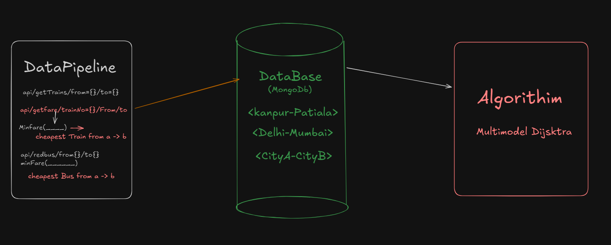

# Path Panda

Path Panda is a smart routing engine designed to calculate the cheapest (and eventually fastest) way to travel between any two Indian cities. It takes into account multiple transportation modes such as trains and buses, and uses an algorithmic approach to determine the optimal route.

## Overview of the Application

## Architecture of the Application

Path-Panda is structured into three Components

### 1. Data Pipeline

- This is the backend service responsible for fetching all transport-related data from external APIs and organizing it for storage and computation.
- IRCTC TRAIN DATA: From RapidAPI
- BUS ROUTES: Are webscraped and hardCoded

#### 1.0 Data Pipeline Sample

- Note: getTrains endPoint doesnt fetchs fare details, thats why another getFare endpoint is used to fetch fares for every train.

✅ Responsibility: Pull data, compute minimum fares, and push structured city-pair data into the database.

### 2. Database(MongoDB)

This component stores all fare information between city pairs in a clean and searchable format. Example entries:

- <Kanpur-Patiala>

- <Delhi-Mumbai>

- <CityA-CityB>

✅ Responsibility: Act as a persistent graph representation where each document corresponds to a direct route between two cities with its fare and transport mode.

### 3. Multimodal Dijkstra Algorithim

``- This is the heart of Path-Panda. It reads data from the MongoDB database and creates a graph structure where:
Nodes = Cities
Edges = Direct routes (bus/train) with weights = fare

- Then it applies a modified Dijkstra’s Algorithm to find the cheapest path from the source to destination, considering multiple transport modes.

✅ Responsibility: Calculate the optimal (cheapest) path across different modes from point A to point B.

### 4. Data Flow Summary

`[DataPipeline] → (fetch + compute fares) → [MongoDB] → (graph building) → [Algorithm → Optimal Path]`
